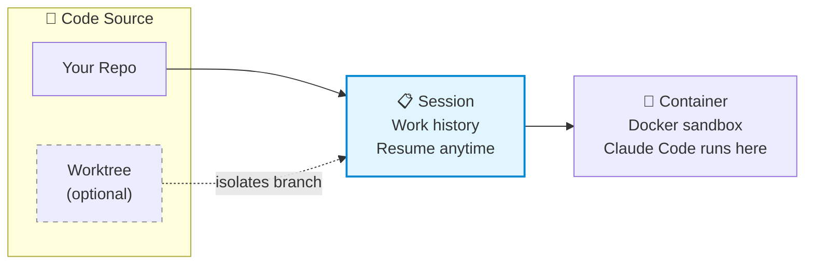

<h1 align="center">SCC - Sandboxed Claude CLI</h1>

<p align="center">
  <a href="https://pypi.org/project/scc-cli/"></a>
  <a href="https://pypi.org/project/scc-cli/"></a>
  <a href="https://opensource.org/licenses/MIT"></a>
  <a href="#contributing"></a>
</p>

<p align="center">
  <a href="#quick-start">Quick Start</a> ·
  <a href="#commands">Commands</a> ·
  <a href="#configuration">Configuration</a> ·
  <a href="docs/ARCHITECTURE.md">Architecture</a> ·
  <a href="#contributing">Contributing</a>
</p>

---

Run Claude Code in Docker sandboxes with organization-managed team profiles and git worktree support.

SCC isolates AI execution in containers, enforces branch safety, and lets organizations distribute Claude plugins through a central configuration. Developers get standardized setups without manual configuration.

## 30-Second Guide

```bash
pip install scc-cli      # Install
scc setup                # Configure (interactive wizard, ~2 min)
scc start ~/project      # Launch Claude Code in sandbox
```

That's it. Check `scc --version` for version info, `scc doctor` if something's wrong.

### How It Works



> **Durability:** Sessions persist across restarts. Containers are ephemeral (recreated each launch).

| Concept | Commands | Notes |
|---------|----------|-------|
| **Session** | `scc start`, `--resume`, `--select` | Your work history, the "brain" |
| **Container** | `scc list`, `scc stop`, `scc prune` | Isolated Docker sandbox |
| **Worktree** | `scc worktree`, `scc cleanup` | Optional parallel branches |

**Most users just:** `scc start ~/repo` — worktrees are for parallel development.

## Installation

```bash
pip install scc-cli
```

Or with pipx:

```bash
pipx install scc-cli
```

Requires Python 3.10+, Docker Desktop 4.50+, and Git 2.30+.

## Quick Start

```bash
# Run setup wizard
scc setup

# Start Claude Code in a sandbox
scc start ~/projects/api-service --team platform

# Check system health
scc doctor
```

## Daily Commands

Quick reference for everyday development:

| Command | What it does |
|---------|--------------|
| `scc start ~/project` | Launch Claude Code in sandbox |
| `scc start --resume` | Resume most recent session |
| `scc start --select` | Pick from recent sessions |
| `scc stop` | Stop running sandbox(es) |
| `scc list` | Show running containers |
| `scc prune` | Clean up stopped containers |
| `scc doctor` | Check system health |
| `scc config explain` | Debug why something was blocked |
| `scc teams` | List available team profiles |
| `scc setup --team <name>` | Switch to a different team |

## Usage

### Interactive mode

Running `scc` without arguments launches an interactive workspace selector:

```bash
scc
```

This shows recent workspaces and lets you pick where to start. For CI/scripts, use explicit commands instead:

```bash
# CI/automation: always specify the path explicitly
scc start /path/to/repo --team platform
```

### Starting sessions

```bash
# With team profile
scc start ~/projects/my-repo --team platform

# Resume most recent session
scc start --resume

# Pick from recent sessions interactively
scc start --select

# Offline mode (cache only)
scc start ~/projects/my-repo --offline
```

### Parallel development with worktrees

Use worktrees when you need to work on multiple features simultaneously without context switching. Each worktree gets its own directory, branch, and Claude session—ideal for parallel AI-assisted development.

```bash
# Create isolated workspace
scc worktree ~/projects/api-service feature-auth
# Creates: ~/projects/api-service-worktrees/feature-auth/
# Branch: claude/feature-auth

# With dependency installation
scc worktree ~/projects/api-service feature-x --install-deps

# List worktrees
scc worktrees ~/projects/api-service

# Clean up
scc cleanup ~/projects/api-service feature-auth
```

### Managing configuration

```bash
# List team profiles
scc teams

# Refresh from remote
scc teams --sync

# Check for CLI and config updates
scc update

# View effective configuration
scc config explain

# List recent sessions
scc sessions

# View usage stats
scc stats
```

### Switching teams

To change your team profile without running the full setup wizard:

```bash
# Switch to a different team
scc setup --team backend-java

# See available teams first
scc teams
```

This updates your profile selection while keeping your organization connection intact.

### Temporary overrides

If governance blocks something you need:

```bash
# Unblock a resource for 8 hours (delegation denials only)
scc unblock jira-api --ttl 8h --reason "Sprint demo"

# List active exceptions
scc exceptions list

# Clean up expired exceptions
scc exceptions cleanup
```

Local overrides work for delegation denials. Security blocks require policy exceptions via PR. See [GOVERNANCE.md](docs/GOVERNANCE.md#exceptions).

### Plugin auditing

Check what MCP servers and hooks are declared by installed plugins:

```bash
# Human-readable summary
scc audit plugins

# JSON for CI pipelines
scc audit plugins --json
```

Exit code 0 means all manifests parsed. Exit code 1 means parsing errors found.

## Commands

| Command | Description |
|---------|-------------|
| `scc` | Interactive mode |
| `scc setup` | Configure organization connection |
| `scc start <path>` | Start Claude Code in sandbox |
| `scc stop` | Stop running sandbox(es) |
| `scc doctor` | Check prerequisites |
| `scc update` | Check for CLI and config updates |
| `scc teams` | List team profiles |
| `scc sessions` | List recent sessions |
| `scc stats` | View usage statistics |
| `scc statusline` | Configure status line for worktree info |
| `scc list` | List running containers |
| `scc prune` | Remove stopped containers (dry-run by default) |
| `scc worktree <repo> <name>` | Create git worktree |
| `scc worktrees <repo>` | List worktrees |
| `scc cleanup <repo> <name>` | Remove worktree |
| `scc config` | View or edit configuration |
| `scc config explain` | Show effective config with sources |
| `scc unblock <target>` | Create temporary override for blocked resource |
| `scc exceptions list` | List active and expired exceptions |
| `scc audit plugins` | Audit installed plugins for MCP servers and hooks |

Run `scc <command> --help` for options.

## Configuration

### Setup modes

Organization mode connects to a central config:

```bash
scc setup
# Enter URL when prompted: https://gitlab.example.org/devops/scc-config.json
```

Standalone mode runs without organization config:

```bash
scc setup --standalone
```

### Config inheritance

Configuration flows through three layers:

1. **Organization** - security boundaries, default plugins, delegation rules
2. **Team profile** - additional plugins and MCP servers for specific teams
3. **Project** - `.scc.yaml` in repo root for project-specific settings

Organizations define what teams can add. Teams define what projects can add. Security blocks (like `blocked_plugins: ["malicious-*"]`) cannot be overridden at any level.

See [GOVERNANCE.md](docs/GOVERNANCE.md) for delegation rules and examples.

### Project config

Add `.scc.yaml` to your repository root:

```yaml
additional_plugins:
  - "project-linter"

session:
  timeout_hours: 4
```

### User config

Located at `~/.config/scc/config.json`:

```json
{
  "organization_source": {
    "url": "https://gitlab.example.org/devops/scc-config.json",
    "auth": "env:GITLAB_TOKEN"
  },
  "selected_profile": "platform"
}
```

Edit with `scc config --edit`.

### Authentication methods

| Method | Syntax |
|--------|--------|
| Environment variable | `"auth": "env:GITLAB_TOKEN"` |
| Command | `"auth": "command:op read op://Dev/token"` |
| None (public) | `"auth": null` |

### File locations

```
~/.config/scc/           # Configuration
├── config.json          # Org URL, team, preferences

~/.cache/scc/            # Cache (safe to delete)
├── org_config.json      # Remote config cache
├── cache_meta.json      # ETags, timestamps
└── usage.jsonl          # Session usage events

<repo>/
└── .scc.yaml            # Project-specific config
```

## Troubleshooting

Run `scc doctor` to diagnose issues.

| Problem | Solution |
|---------|----------|
| Docker not reachable | Start Docker Desktop |
| Organization config fetch failed | Check URL and token |
| Slow file operations (WSL2) | Move project to `~/projects`, not `/mnt/c/` |
| Permission denied (Linux) | `sudo usermod -aG docker $USER` |
| Plugin blocked | Check `scc config explain` for security blocks |
| Addition denied | `scc unblock <target> --ttl 8h --reason "..."` |
| Plugin audit shows malformed | Fix JSON syntax in plugin's `.mcp.json` or `hooks.json` |

See [TROUBLESHOOTING.md](docs/TROUBLESHOOTING.md) for more solutions.

### WSL2

Run inside WSL2, not Windows. Keep projects in the Linux filesystem for acceptable performance.

### Container management

SCC containers accumulate over time. Clean them up safely:

```bash
# See what would be removed (dry run, default)
scc prune

# Actually remove stopped containers
scc prune --yes

# To clean up everything: stop first, then prune
scc stop && scc prune --yes
```

`scc prune` only removes **stopped** SCC containers (labeled `scc.managed=true`). It never touches running containers or non-SCC workloads.

## Documentation

- [Architecture](docs/ARCHITECTURE.md) - system design, module structure, data flow
- [Governance](docs/GOVERNANCE.md) - delegation model, security boundaries, config examples
- [Troubleshooting](docs/TROUBLESHOOTING.md) - common problems and solutions
- [Development](CLAUDE.md) - contributing guidelines, TDD methodology

## Development

```bash
# Install dependencies
uv sync

# Run tests
uv run pytest

# Run linter
uv run ruff check --fix
```

## Optional: Shell Completion

Enable tab completion for scc commands:

```bash
# Bash
scc --install-completion bash

# Zsh
scc --install-completion zsh

# Fish
scc --install-completion fish
```

Restart your shell after installation.

## License

MIT
