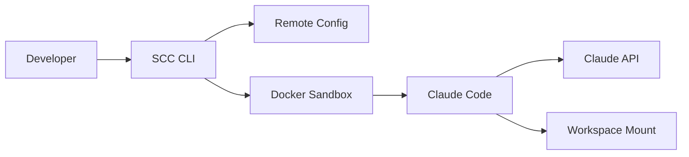
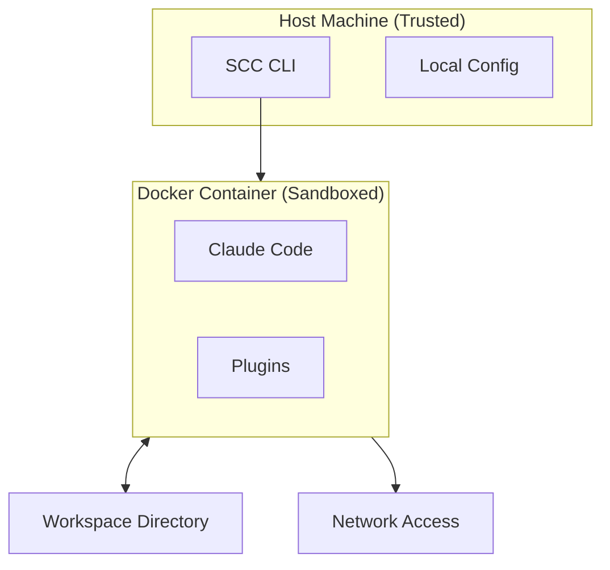
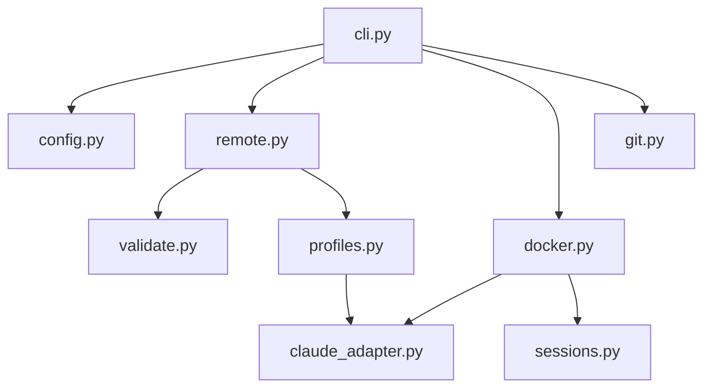
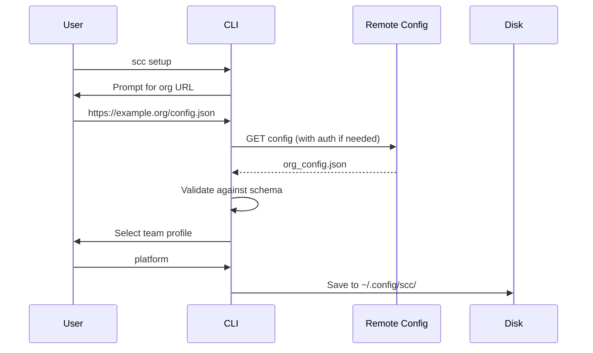
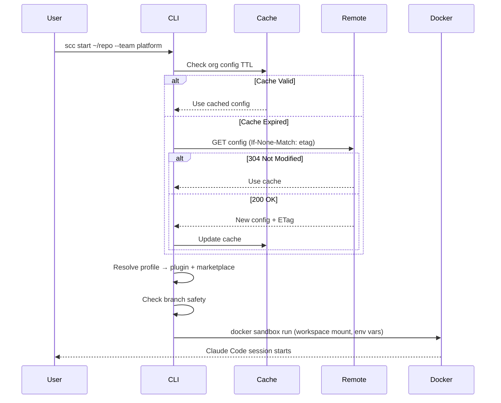

# Architecture

SCC runs Claude Code in Docker containers with mounted workspaces. It pulls org config from a URL, expands team profiles into plugin sets, and injects settings into the sandbox.

## High-Level Overview



SCC acts as orchestration layer only. It does not download plugins, communicate with Claude's API, or run any AI logic. Claude Code inside the container handles all of that.

## Scope and Constraints

**What SCC does:**
- Fetches and caches organization config from any HTTPS URL
- Resolves team profiles to marketplace plugin references
- Manages git worktrees for parallel development
- Enforces branch safety via repo-local hooks
- Launches Docker sandbox with injected credentials

**What SCC does not do:**
- Download or cache plugin content
- Verify plugin integrity or signatures
- Communicate with Claude's API
- Restrict container network traffic
- Guarantee security against malicious AI behavior

## Security Model

Docker provides process isolation, not containment of a malicious model.



**Trust boundaries:**

| Boundary | Isolated | Shared |
|----------|----------|--------|
| Filesystem | Host system | Mounted workspace (read/write) |
| Process | Host processes | Container processes |
| Network | None | Full access (required for Claude API) |
| Environment | Host env vars | Explicitly passed tokens |

**Credential flow:**
- Tokens resolved from `env:VAR` or `command:CMD` syntax
- Injected into container via Docker environment variables
- Never written to disk or printed in logs

## Component Design



**Module responsibilities:**

| Module | Does | Does Not |
|--------|------|----------|
| `profiles.py` | Profile resolution, marketplace URLs | HTTP, file I/O |
| `remote.py` | HTTP fetch, auth, ETag caching | Business logic |
| `claude_adapter.py` | Claude Code format knowledge | HTTP, profiles |
| `validate.py` | Schema validation | HTTP, file I/O |
| `config.py` | Local config, XDG paths | Remote fetching |
| `docker.py` | Container lifecycle, credential injection | URL building |

The `claude_adapter.py` module isolates all Claude Code format knowledge. When Claude changes their settings format, only this file needs updating.

## Lifecycle Flows

### Setup



### Start Session



## Configuration Precedence

From highest to lowest priority:

1. CLI flags (`--team`, `--offline`)
2. User config (`~/.config/scc/config.json`)
3. Organization config (remote-fetched, cached)
4. Built-in defaults

## File Locations

```
~/.config/scc/
    config.json         # Org URL, selected profile, preferences

~/.cache/scc/
    org_config.json     # Cached remote config
    cache_meta.json     # ETags, timestamps

~/projects/
    my-repo/            # Main repository
    my-repo-worktrees/  # Worktrees created by SCC
        feature-a/
        hotfix-123/

<repo>/.git/hooks/
    pre-push            # SCC-managed hook (opt-in)
```

## Performance

| Operation | Time | Notes |
|-----------|------|-------|
| Container resume | ~500ms | Typical case with re-use |
| Container create | 3-5s | Cold start |
| Config fetch | 100-500ms | HTTP with auth |
| Cache check | ~5ms | Local TTL comparison |
| Worktree create | 500ms-5min | Depends on `--install-deps` |

Container re-use makes resume 10x faster than fresh containers. Each workspace+branch combination gets a deterministic container name (`scc-<hash>-<hash>`) for automatic re-use.

## Design Decisions

### Why remote config?

Organizations update their configs without requiring CLI updates. IT teams manage profiles centrally. One URL change propagates to all developers.

### Why worktrees over branches?

Developers context-switch frequently. Worktrees allow multiple Claude Code sessions running in parallel, each with its own container and conversation state.

### Why container re-use?

Claude Code maintains conversation context inside the container. Fresh containers lose this context. Trade-off: containers accumulate and need periodic cleanup with `docker container prune`.

### Why XDG paths?

Standard conventions allow easy backup (`~/.config/scc/`) while keeping regenerable cache separate (`~/.cache/scc/`). Cache deletion is always safe.

### Why typed exceptions?

All errors inherit from `SCCError` with:
- `user_message`: Plain language explanation
- `suggested_action`: Concrete next step
- `exit_code`: For scripting (3=prerequisites, 4=external tool, 5=internal)

## Limitations

- **WSL2 performance**: Workspaces on `/mnt/c/...` are slow. CLI warns but cannot fix this.
- **Container accumulation**: Old containers not auto-cleaned. Run `docker container prune` periodically.
- **Single session per branch**: Cannot run multiple sessions on same workspace+branch simultaneously.
- **Network required**: Org config fetch needs network. Use `--offline` for cache-only mode.
