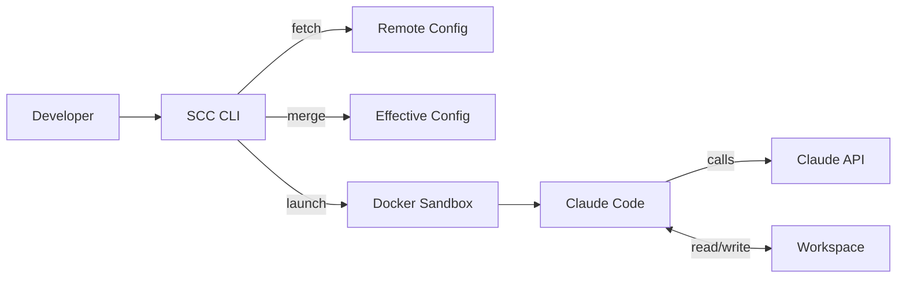
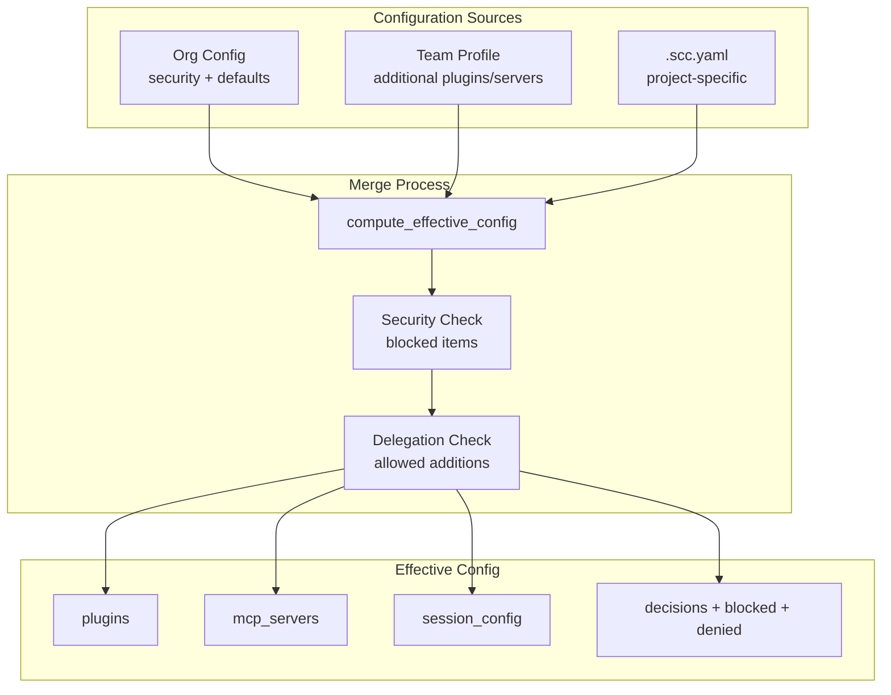
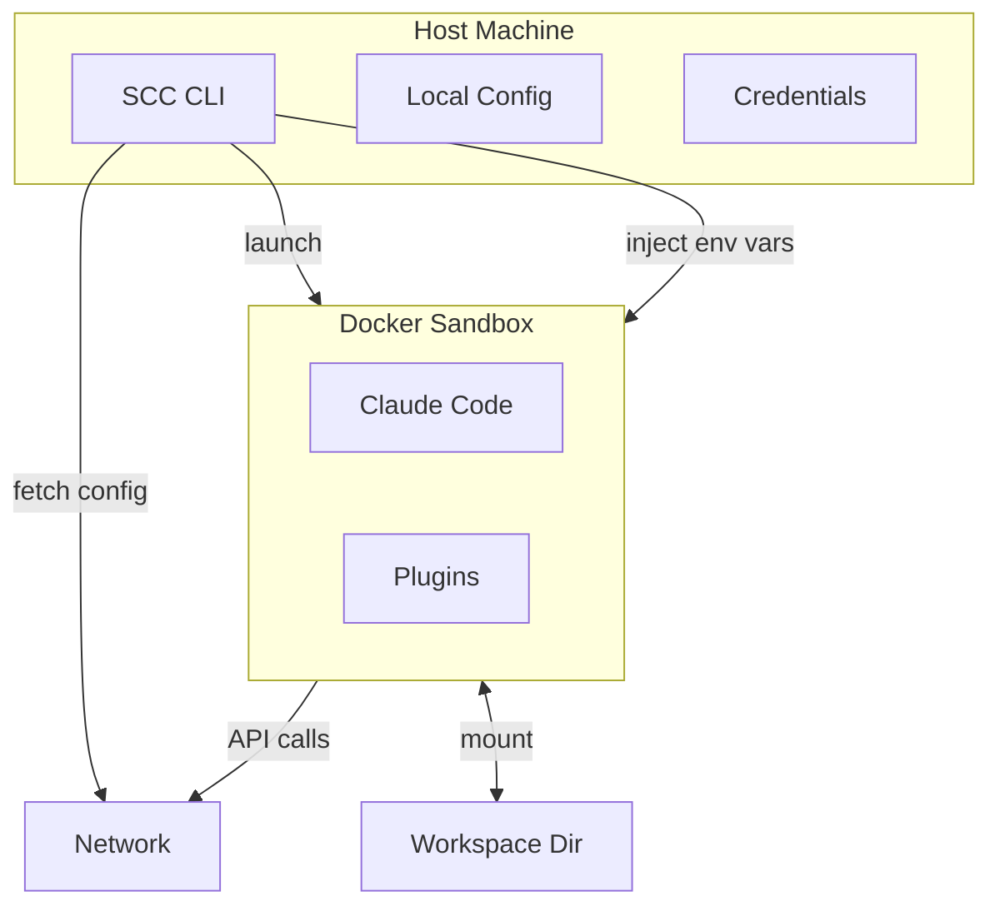
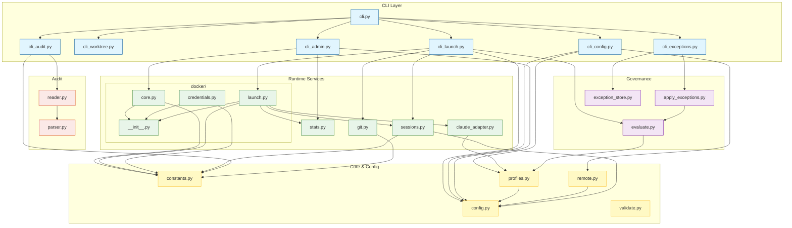
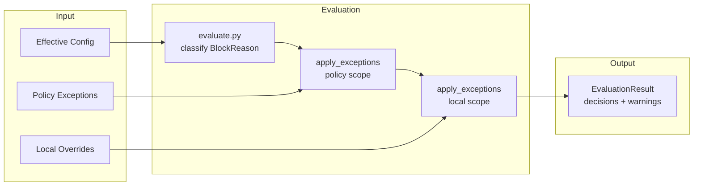
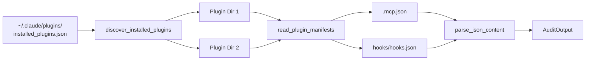

# Architecture

SCC runs Claude Code in Docker containers with mounted workspaces. It pulls org config from a URL, computes effective configuration through a 3-layer merge, and injects settings into the sandbox.

## Overview



SCC acts as orchestration layer only. It does not download plugins, communicate with Claude's API, or run any AI logic. Claude Code inside the container handles all of that.

## Scope

What SCC does:
- Fetches and caches organization config from any HTTPS URL
- Computes effective config by merging org defaults, team profile, and project overrides
- Enforces security boundaries that cannot be overridden
- Tracks delegation rules for what teams and projects can add
- Manages git worktrees for parallel development
- Enforces branch safety via repo-local hooks
- Launches Docker sandbox with injected credentials
- Records usage statistics locally
- Checks for CLI updates from PyPI

What SCC does not do:
- Download or cache plugin content
- Verify plugin integrity or signatures
- Communicate with Claude's API
- Restrict container network traffic

## Config Inheritance

Configuration flows through three layers. Each layer can add to the previous, subject to security boundaries and delegation rules.



### Merge Rules

1. Start with organization defaults (plugins, MCP servers, session config)
2. Apply team profile additions (if team is delegated)
3. Apply project config additions (if delegation permits)
4. Block anything matching security patterns
5. Record all decisions for `scc config explain`

### Security Boundaries

Organization config defines security blocks using glob patterns. These cannot be overridden:

```yaml
security:
  blocked_plugins:
    - "known-malicious-*"
  blocked_mcp_servers:
    - "*.untrusted.com"
  blocked_base_images:
    - "*:latest"
  allow_stdio_mcp: false
  allowed_stdio_prefixes:
    - "/usr/local/bin/"
```

Pattern matching is case-insensitive (using Unicode-aware casefolding). Untagged Docker images are normalized to `:latest` before matching.

Stdio MCP servers require explicit opt-in (`allow_stdio_mcp: true`) and can be restricted to specific path prefixes. Path traversal is blocked via realpath resolution with commonpath validation.

If a team or project tries to add a blocked item, it appears in `blocked_items`. Items that fail delegation checks appear in `denied_additions`.

### Delegation

Organizations control what teams can add:

```yaml
delegation:
  teams:
    allow_additional_plugins: ["*"]           # teams can add any plugin
    allow_additional_mcp_servers: ["finance"] # only finance team can add servers
```

Teams control what projects can add:

```yaml
profiles:
  finance:
    delegation:
      allow_project_overrides: true  # projects can add within team's scope
```

See [GOVERNANCE.md](GOVERNANCE.md) for detailed delegation rules and examples.

### Project Config

Projects add their own configuration via `.scc.yaml` in the repository root:

```yaml
additional_plugins:
  - "project-linter"

additional_mcp_servers:
  - name: "project-api"
    type: "sse"
    url: "https://api.internal/mcp"

session:
  timeout_hours: 4
```

### Debugging Config

`scc config explain` shows exactly what's active and why:

```
scc config explain
scc config explain --field plugins
scc config explain --workspace /path/to/project
```

Each setting shows its source (org.defaults, team.X, project) and any blocked or denied items.

## Security Model

Docker provides process isolation, not containment of a malicious model.



Trust boundaries:

| Boundary | Isolated | Shared |
|----------|----------|--------|
| Filesystem | Host system | Mounted workspace (read/write) |
| Process | Host processes | Container processes |
| Network | None | Full access (required for Claude API) |
| Environment | Host env vars | Explicitly passed tokens |

**Plugin content is trusted as a unit** — SCC does not download or inspect plugin internals (including bundled `.mcp.json` servers); policy is enforced at the enable/disable boundary only.

Credential flow:
- Tokens resolved from `env:VAR` or `command:CMD` syntax
- Injected into container via Docker environment variables
- Never written to disk or printed in logs

## Module Design



This diagram shows module dependencies. Blue = CLI commands, Yellow = core config, Purple = governance, Orange = audit, Green = runtime services. The `docker/` package contains three submodules: `core.py` (primitives), `credentials.py` (OAuth persistence), and `launch.py` (orchestration).

Module responsibilities:

| Module | Does | Does Not |
|--------|------|----------|
| `constants.py` | Centralize backend-specific values (agent name, image tag, volume names, credential paths, branch prefixes) | Business logic, I/O operations |
| `profiles.py` | Profile resolution, effective config computation, delegation checks, security validation (blocked patterns, stdio gate, image normalization) | HTTP, file I/O |
| `remote.py` | HTTP fetch, auth, ETag caching | Business logic |
| `claude_adapter.py` | Claude Code format knowledge, MCP server translation | HTTP, profiles |
| `validate.py` | Schema validation | HTTP, file I/O |
| `config.py` | Local config, XDG paths, project config reading | Remote fetching |
| `docker/` | Docker sandbox operations (package) | URL building |
| `docker/core.py` | Container lifecycle, Docker primitives, command building | Credential handling |
| `docker/credentials.py` | Credential persistence, OAuth token management, volume sync | Container launching |
| `docker/launch.py` | High-level launch orchestration, settings injection | Low-level Docker ops |
| `stats.py` | Session recording, aggregation, reporting | Container operations |
| `update.py` | Version checking, throttling, notifications | Container operations |
| `evaluation/evaluate.py` | Pure governance evaluation, BlockReason classification | I/O, exception storage |
| `evaluation/apply_exceptions.py` | Exception overlay (policy and local scopes) | Storage, HTTP |
| `stores/exception_store.py` | JSON read/write, backup-on-corrupt, prune expired | Business logic |
| `audit/parser.py` | JSON manifest parsing, error extraction | File I/O |
| `audit/reader.py` | Plugin discovery, manifest file reading | Parsing logic |

The `claude_adapter.py` module isolates all Claude Code format knowledge. When Claude changes their settings format, only this file needs updating.

## Usage Stats

SCC tracks session usage locally for reporting to leadership.

### What's Recorded

Each session records:
- Session ID and timestamps
- Project name (folder name)
- Team name
- Duration (expected and actual)
- User ID (hashed for privacy)

Data is stored in `~/.cache/scc/usage.jsonl` as newline-delimited JSON.

### Privacy

User identity is hashed by default. The hash is consistent per user but cannot be reversed to identify them. Organizations can configure `stats.user_identity_mode` to `hash` (default), `username`, or `anonymous`.

### Commands

```bash
scc stats                    # show your usage summary
scc stats --days 7           # last 7 days only
scc stats export --json      # export for aggregation
scc stats aggregate *.json   # combine multiple exports
```

### Incomplete Sessions

If a session doesn't end cleanly (container crash, Ctrl+C, power loss), it's tracked as "incomplete". The expected duration from config is used as an estimate.

## Update System

SCC checks for updates to both the CLI package and organization config.

### Throttling

| Check Type | Interval | Rationale |
|------------|----------|-----------|
| CLI version (PyPI) | 24 hours | Package releases are infrequent |
| Org config | 1 hour | Config changes need faster propagation |

### CLI Updates

```
GET https://pypi.org/pypi/scc-cli/json
→ Compare with installed version
→ Detect install method (pip, pipx, uv)
→ Generate appropriate upgrade command
```

### Org Config Updates

```
GET https://example.org/config.json
If-None-Match: "abc123"

→ 304 Not Modified: Use cache
→ 200 OK: Update cache
→ 401/403: Warn user
→ Network error: Use stale cache if available
```

## Exceptions System

Exceptions allow temporary overrides when governance blocks something you need.

### Two Scopes

| Scope | Storage | Can Override | Approval |
|-------|---------|--------------|----------|
| Local | `~/.config/scc/exceptions.json` or `.scc/exceptions.json` | Delegation denials only | Self-serve |
| Policy | Config repo (org/team/project) | Any block (security + delegation) | PR review |

Local overrides handle delegation denials (team not allowed to add something). Security blocks (org-level `blocked_*` patterns) require policy exceptions stored in the config repo.

### Evaluation Flow



Security blocks are tagged with `BlockReason.SECURITY` and cannot be overridden by local exceptions. Delegation denials are tagged with `BlockReason.DELEGATION` and can be overridden by either scope.

### Storage

Exception files use JSON with schema versioning for forward compatibility:

```json
{
  "schema_version": 1,
  "exceptions": [
    {
      "id": "local-20251221-a3f2",
      "created_at": "2025-12-21T10:00:00Z",
      "expires_at": "2025-12-21T18:00:00Z",
      "reason": "Sprint demo",
      "scope": "local",
      "allow": {"mcp_servers": ["jira-api"]}
    }
  ]
}
```

Corrupt files are backed up to `*.bak-YYYYMMDD` and replaced with an empty store. Expired exceptions are pruned on write operations.

## Plugin Audit

The audit system provides visibility into installed Claude Code plugin manifests.

### Discovery



### Manifest Status

| Status | Meaning | CI Exit Code |
|--------|---------|--------------|
| `parsed` | Valid JSON, content extracted | 0 |
| `missing` | File not found (expected) | 0 |
| `malformed` | Invalid JSON syntax | 1 |
| `unreadable` | Permission error | 1 |

Exit code 1 signals CI to fail the pipeline when manifest problems exist.

### Output

Human output shows a summary table with MCP server and hook counts. JSON output includes full manifest content with `schemaVersion: 1` for automation.

The audit is informational only. SCC does not enforce plugin internals.

## Lifecycle Flows

### Setup

```
scc setup
→ Prompt for org URL
→ GET config (with auth if needed)
→ Validate against schema
→ Prompt for team profile
→ Save to ~/.config/scc/
```

### Start Session

```
scc start ~/repo --team platform
→ Check org config TTL (refresh if stale)
→ Read .scc.yaml if present
→ compute_effective_config(org, team, project)
→ Check for blocked items → error if any
→ Record session_start event
→ Check branch safety
→ docker sandbox run (workspace mount, env vars, injected settings)
```

## Configuration Precedence

From highest to lowest priority:

1. CLI flags (`--team`, `--offline`)
2. User config (`~/.config/scc/config.json`)
3. Project config (`.scc.yaml` in workspace)
4. Team profile (from org config)
5. Organization defaults (from org config)
6. Built-in defaults

Security boundaries from org config override everything.

## File Locations

```
~/.config/scc/
    config.json              # Org URL, selected profile, preferences
    exceptions.json          # User-scoped local overrides

~/.cache/scc/
    org_config.json          # Cached remote config
    cache_meta.json          # ETags, timestamps
    update_check_meta.json   # Update check throttling
    usage.jsonl              # Session usage events

~/.claude/
    plugins/
        installed_plugins.json   # Claude Code plugin registry
        <plugin-name>/           # Installed plugin directories

~/projects/
    my-repo/                 # Main repository
        .scc.yaml            # Project-specific config (optional)
        .scc/
            exceptions.json  # Repo-scoped local overrides (optional)
    my-repo-worktrees/       # Worktrees created by SCC
        feature-a/
        hotfix-123/

<repo>/.git/hooks/
    pre-push                 # SCC-managed hook (opt-in)
```

## Performance

| Operation | Time | Notes |
|-----------|------|-------|
| Container resume | ~500ms | Typical with re-use |
| Container create | 3-5s | Cold start |
| Config fetch | 100-500ms | HTTP with auth |
| Cache check | ~5ms | Local TTL comparison |
| Effective config compute | <10ms | In-memory merge |
| Update check | 200-800ms | PyPI + org config (when not throttled) |
| Worktree create | 500ms-5min | Depends on `--install-deps` |

## Design Decisions

### Why 3-layer config inheritance?

Organizations need central control. Teams need flexibility. Projects need customization. The 3-layer model lets IT set security boundaries while developers work productively.

### Why security boundaries that can't be overridden?

A team member shouldn't be able to bypass org security policy by adding a `.scc.yaml` file. Blocked patterns in org config are absolute.

### Why track delegation decisions?

When something doesn't work, developers need to know why. `scc config explain` shows exactly what's blocked and who blocked it.

### Why remote config?

Organizations update their configs without requiring CLI updates. IT teams manage profiles centrally. One URL change propagates to all developers.

### Why throttled update checks?

Checking PyPI and remote config on every command would add latency. Throttling (24h for CLI, 1h for org config) balances freshness with responsiveness.

### Why worktrees over branches?

Developers context-switch frequently. Worktrees allow multiple Claude Code sessions running in parallel, each with its own container and conversation state.

### Why local stats only?

Phase 1 keeps stats local to avoid infrastructure requirements. Teams aggregate manually via `scc stats export` and `scc stats aggregate`. Central collection is planned for Phase 2.

### Why XDG paths?

Standard conventions allow easy backup (`~/.config/scc/`) while keeping regenerable cache separate (`~/.cache/scc/`). Cache deletion is always safe.

## Limitations

- WSL2 performance: Workspaces on `/mnt/c/...` are slow. CLI warns but cannot fix this.
- Container accumulation: Old containers not auto-cleaned. Run `docker container prune` periodically.
- Single session per branch: Cannot run multiple sessions on same workspace+branch simultaneously.
- Network required: Org config fetch needs network. Use `--offline` for cache-only mode.
- Stats on Unix: Session end time cannot be recorded due to `os.execvp` replacing the process. Sessions without clean exit are marked "incomplete".
