# Architecture

SCC runs Claude Code in Docker containers with mounted workspaces. It pulls org config from a URL, computes effective configuration through a 3-layer merge, and injects settings into the sandbox.

## Overview


SCC acts as orchestration layer only. It does not download plugins, communicate with Claude's API, or run any AI logic. Claude Code inside the container handles all of that.

## Scope

What SCC does:
- Fetches and caches organization config from any HTTPS URL
- Computes effective config by merging org defaults, team profile, and project overrides
- Enforces security boundaries that cannot be overridden
- Tracks delegation rules for what teams and projects can add
- Manages git worktrees for parallel development
- Enforces branch safety via repo-local hooks
- Launches Docker sandbox with injected credentials
- Records usage statistics locally
- Checks for CLI updates from PyPI

What SCC does not do:
- Download or cache plugin content
- Verify plugin integrity or signatures
- Communicate with Claude's API
- Restrict container network traffic

## Config Inheritance

Configuration flows through three layers. Each layer can add to the previous, subject to security boundaries and delegation rules.


### Merge Rules

1. Start with organization defaults (plugins, MCP servers, session config)
2. Apply team profile additions (if team is delegated)
3. Apply project config additions (if delegation permits)
4. Block anything matching security patterns
5. Record all decisions for `scc config explain`

### Security Boundaries

Organization config defines security blocks using glob patterns. These cannot be overridden:

```yaml
security:
  blocked_plugins:
    - "known-malicious-*"
  blocked_mcp_servers:
    - "*.untrusted.com"
  blocked_base_images:
    - "*:latest"
  allow_stdio_mcp: false
  allowed_stdio_prefixes:
    - "/usr/local/bin/"
```

Pattern matching is case-insensitive (using Unicode-aware casefolding). Untagged Docker images are normalized to `:latest` before matching.

Stdio MCP servers require explicit opt-in (`allow_stdio_mcp: true`) and can be restricted to specific path prefixes. Path traversal is blocked via realpath resolution with commonpath validation.

If a team or project tries to add a blocked item, it appears in `blocked_items`. Items that fail delegation checks appear in `denied_additions`.

### Delegation

Organizations control what teams can add:

```yaml
delegation:
  teams:
    allow_additional_plugins: ["*"]           # teams can add any plugin
    allow_additional_mcp_servers: ["finance"] # only finance team can add servers
```

Teams control what projects can add:

```yaml
profiles:
  finance:
    delegation:
      allow_project_overrides: true  # projects can add within team's scope
```

See [GOVERNANCE.md](GOVERNANCE.md) for detailed delegation rules and examples.

### Project Config

Projects add their own configuration via `.scc.yaml` in the repository root:

```yaml
additional_plugins:
  - "project-linter"

additional_mcp_servers:
  - name: "project-api"
    type: "sse"
    url: "https://api.internal/mcp"

session:
  timeout_hours: 4
```

### Debugging Config

`scc config explain` shows exactly what's active and why:

```
scc config explain
scc config explain --field plugins
scc config explain --workspace /path/to/project
```

Each setting shows its source (org.defaults, team.X, project) and any blocked or denied items.

### Team & Workspace Behavior

SCC supports multi-project workflows where different workspaces may be associated with different teams.

#### Workspace-Team Pinning

When you launch a session, SCC remembers which team was used:

```
~/.config/scc/config.json:
{
  "workspace_team_map": {
    "/home/user/backend-api": "platform",
    "/home/user/frontend-app": "web-team"
  }
}
```

On subsequent launches:
1. If workspace has a pinned team different from global selection, SCC prompts for confirmation
2. Interactive mode shows the pinned team context in picker headers
3. The mapping updates automatically when you switch teams in a workspace

#### Session-Only Team Override

The `--team` flag affects only the current session without changing your global default:

```bash
scc start --team security ~/project    # Uses security team for this session only
scc team show                          # Still shows original global team
```

This is useful for:
- Testing with different team configs
- Quick switches without disrupting muscle memory
- CI/CD with explicit team targeting

#### Config Precedence

Settings are resolved in order (later overrides earlier):

1. **Defaults** — Built-in SCC defaults
2. **Organization config** — Remote org policies (`security`, `defaults`, `delegation`)
3. **Team profile** — Team-specific plugins/servers (within delegation limits)
4. **Project config** — `.scc.yaml` additions (within delegation limits)
5. **Environment** — `SCC_*` environment variables
6. **Flags** — CLI flags (`--team`, `--standalone`, `--offline`)

Security blocks are applied at merge time and cannot be overridden by any layer.

## Security Model

Docker provides process isolation, not containment of a malicious model.


Trust boundaries:

| Boundary | Isolated | Shared |
|----------|----------|--------|
| Filesystem | Host system | Mounted workspace (read/write) |
| Process | Host processes | Container processes |
| Network | None | Full access (required for Claude API) |
| Environment | Host env vars | Explicitly passed tokens |

**Plugin content is trusted as a unit** — SCC does not download or inspect plugin internals (including bundled `.mcp.json` servers); policy is enforced at the enable/disable boundary only.

Credential flow:
- Tokens resolved from `env:VAR` or `command:CMD` syntax
- Injected into container via Docker environment variables
- Never written to disk or printed in logs

### Safety-Net Policy Injection

The safety-net plugin provides an additional security layer that blocks destructive git commands. Organizations configure this in their org config, and SCC injects the policy into containers using a read-only bind mount.


**How it works:**

1. **Policy extraction**: SCC reads `security.safety_net` from org config at launch time
2. **Atomic file write**: Policy is written to `~/.cache/scc/effective_policy.json` using temp file + rename pattern (crash-safe)
3. **Read-only mount**: File is mounted into container with `:ro` flag (kernel-enforced, cannot be bypassed with sudo)
4. **Environment variable**: `SCC_POLICY_PATH` tells the plugin where to find the policy
5. **Fail-safe default**: If no policy is configured, defaults to `{"action": "block"}` (strictest mode)

**Why read-only bind mount?**

The `:ro` flag is kernel-enforced at the VFS layer. Even with `sudo` inside the container, write attempts fail with `EROFS` (Read-only file system). This ensures the AI cannot modify or circumvent the safety policy.

**Configuration example:**

```json
{
  "security": {
    "safety_net": {
      "action": "block",
      "block_force_push": true,
      "block_reset_hard": true,
      "block_branch_force_delete": true
    }
  }
}
```

See [MARKETPLACE.md](./MARKETPLACE.md) for full configuration options and the scc-safety-net plugin documentation.

## Module Design

```mermaid
graph TD
    %% Styling for visual distinction
    classDef cli fill:#e1f5fe,stroke:#01579b
    classDef core fill:#fff9c4,stroke:#fbc02d
    classDef gov fill:#f3e5f5,stroke:#7b1fa2
    classDef audit fill:#fbe9e7,stroke:#d84315
    classDef runtime fill:#e8f5e9,stroke:#2e7d32
    classDef ui fill:#e0f2f1,stroke:#00695c

    subgraph CLI[CLI Layer]
        Main[cli.py]:::cli
        Launch[cli_launch.py]:::cli
        Worktree[cli_worktree.py]:::cli
        CfgCLI[cli_config.py]:::cli
        Admin[cli_admin.py]:::cli
        ExcCLI[cli_exceptions.py]:::cli
        AuditCLI[cli_audit.py]:::cli
    end

    subgraph UIPkg[ui/]
        UIGate[gate.py]:::ui
        UIList[list_screen.py]:::ui
        UIPicker[picker.py]:::ui
        UIDash[dashboard.py]:::ui
        UIChrome[chrome.py]:::ui
        UIKeys[keys.py]:::ui
        UIHelp[help.py]:::ui
        UIWizard[wizard.py]:::ui
    end

    subgraph Core[Core & Config]
        Constants[constants.py]:::core
        Config[config.py]:::core
        Remote[remote.py]:::core
        Profiles[profiles.py]:::core
        Validate[validate.py]:::core
    end

    subgraph Governance[Governance]
        Evaluate[evaluate.py]:::gov
        ApplyExc[apply_exceptions.py]:::gov
        ExcStore[exception_store.py]:::gov
    end

    subgraph AuditPkg[Audit]
        AuditReader[reader.py]:::audit
        AuditParser[parser.py]:::audit
    end

    subgraph Runtime[Runtime Services]
        subgraph DockerPkg[docker/]
            DockerInit[__init__.py]:::runtime
            DockerCore[core.py]:::runtime
            DockerCreds[credentials.py]:::runtime
            DockerLaunch[launch.py]:::runtime
        end
        subgraph DoctorPkg[doctor/]
            DoctorInit[__init__.py]:::runtime
            DoctorTypes[types.py]:::runtime
            DoctorChecks[checks.py]:::runtime
            DoctorRender[render.py]:::runtime
        end
        Adapter[claude_adapter.py]:::runtime
        Git[git.py]:::runtime
        Sessions[sessions.py]:::runtime
        Stats[stats.py]:::runtime
    end

    Main --> Launch
    Main --> Worktree
    Main --> CfgCLI
    Main --> Admin
    Main --> ExcCLI
    Main --> AuditCLI
    Main --> UIDash

    Launch --> UIPicker
    Launch --> UIWizard
    Worktree --> UIPicker
    UIWizard --> UIPicker

    UIDash --> UIList
    UIPicker --> UIList
    UIList --> UIChrome
    UIList --> UIKeys
    UIList --> UIHelp
    UIPicker --> UIGate
    UIDash --> UIGate

    Launch --> DockerLaunch
    Launch --> Config
    Launch --> Git
    Launch --> Sessions
    Launch --> Evaluate

    ExcCLI --> ExcStore
    ExcCLI --> ApplyExc

    AuditCLI --> AuditReader
    AuditReader --> AuditParser

    CfgCLI --> Config
    CfgCLI --> Profiles
    CfgCLI --> Remote

    Admin --> Stats
    Admin --> Config
    Admin --> DockerCore

    DockerLaunch --> Adapter
    DockerLaunch --> Sessions
    DockerLaunch --> Stats
    DockerCore --> DockerInit
    DockerCreds --> DockerInit
    DockerLaunch --> DockerInit

    Adapter --> Profiles
    Profiles --> Config
    Remote --> Config
    Evaluate --> Profiles
    ApplyExc --> Evaluate
    Sessions --> Config

    %% Constants provides backend-specific values
    DockerCore --> Constants
    DockerLaunch --> Constants
    DockerCreds --> Constants
    Sessions --> Constants
    AuditCLI --> Constants
    Git --> Constants
```



This diagram shows module dependencies. Blue = CLI commands, Yellow = core config, Purple = governance, Orange = audit, Green = runtime services, Teal = interactive UI. The `docker/` package contains three submodules: `core.py` (primitives), `credentials.py` (OAuth persistence), and `launch.py` (orchestration). The `doctor/` package contains three submodules: `types.py` (data structures), `checks.py` (all health check functions), and `render.py` (orchestration and Rich terminal output). The `ui/` package provides interactive terminal experiences with consistent chrome, keybindings, and behavior patterns. The `wizard.py` module adds start wizard pickers with BACK sentinel navigation for nested screen flows.

Module responsibilities:

| Module | Does | Does Not |
|--------|------|----------|
| `constants.py` | Centralize backend-specific values (agent name, image tag, volume names, credential paths, branch prefixes) | Business logic, I/O operations |
| `profiles.py` | Profile resolution, effective config computation, delegation checks, security validation (blocked patterns, stdio gate, image normalization) | HTTP, file I/O |
| `remote.py` | HTTP fetch, auth, ETag caching | Business logic |
| `claude_adapter.py` | Claude Code format knowledge, MCP server translation | HTTP, profiles |
| `validate.py` | Schema validation | HTTP, file I/O |
| `config.py` | Local config, XDG paths, project config reading | Remote fetching |
| `docker/` | Docker sandbox operations (package) | URL building |
| `docker/core.py` | Container lifecycle, Docker primitives, command building | Credential handling |
| `docker/credentials.py` | Credential persistence, OAuth token management, volume sync | Container launching |
| `docker/launch.py` | High-level launch orchestration, settings injection | Low-level Docker ops |
| `doctor/` | Health checks and system diagnostics (package) | Auto-fixing issues |
| `doctor/types.py` | Data structures (CheckResult, DoctorResult, JsonValidationResult) | Business logic |
| `doctor/checks.py` | All health check functions (Git, Docker, config, cache, org) | Rendering |
| `doctor/render.py` | Orchestration, JSON serialization, Rich terminal rendering | Check logic |
| `stats.py` | Session recording, aggregation, reporting | Container operations |
| `update.py` | Version checking, throttling, notifications | Container operations |
| `evaluation/evaluate.py` | Pure governance evaluation, BlockReason classification | I/O, exception storage |
| `evaluation/apply_exceptions.py` | Exception overlay (policy and local scopes) | Storage, HTTP |
| `stores/exception_store.py` | JSON read/write, backup-on-corrupt, prune expired | Business logic |
| `audit/parser.py` | JSON manifest parsing, error extraction | File I/O |
| `audit/reader.py` | Plugin discovery, manifest file reading | Parsing logic |
| `marketplace/` | Plugin governance and marketplace management (package) | Plugin content |
| `marketplace/schema.py` | Pydantic models for org config, team profiles, config sources, trust grants | Business logic |
| `marketplace/compute.py` | Effective plugin computation (inline and federated teams), 6-step precedence | HTTP, file I/O |
| `marketplace/resolve.py` | EffectiveConfig resolution orchestrator, Phase 1 format adapter | HTTP directly |
| `marketplace/trust.py` | Trust validation, marketplace source pattern matching, security violations | HTTP, caching |
| `marketplace/team_fetch.py` | Team config fetching (GitHub, Git, URL sources), fallback handling | Business logic |
| `marketplace/team_cache.py` | Team config caching, TTL/staleness management, cache metadata | Fetching logic |
| `marketplace/normalize.py` | URL normalization, plugin pattern matching, globstar support | HTTP |
| `marketplace/materialize.py` | Marketplace cloning and local materialization | Pattern matching |
| `marketplace/render.py` | Settings rendering and conflict checking | Materialization |
| `marketplace/constants.py` | Marketplace-specific constants (implicit marketplaces, exit codes) | Business logic |
| `marketplace/managed.py` | Managed state persistence for marketplace operations | Plugin logic |
| `marketplace/sync.py` | Synchronization of marketplace state | Conflict detection |
| `ui/` | Interactive terminal experiences (package) | Non-TTY output |
| `ui/gate.py` | Interactivity policy enforcement, TTY and CI detection | Rendering, business logic |
| `ui/list_screen.py` | Core navigation engine, state management, key handling | Domain logic |
| `ui/picker.py` | Selection workflows, Quick Resume with 3-way results, chrome factory | Navigation internals |
| `ui/dashboard.py` | Tabbed navigation, intent exceptions, toast messages | Selection workflows |
| `ui/wizard.py` | Start wizard pickers with BACK navigation, workspace source selection | Chrome, list internals |
| `ui/chrome.py` | Layout primitives (headers, footers, hints), standalone mode dimming | State management |
| `ui/keys.py` | Key mapping internals, action dispatch | Rendering |
| `ui/help.py` | Mode-aware help overlay | Key handling |

The `claude_adapter.py` module isolates all Claude Code format knowledge. When Claude changes their settings format, only this file needs updating.

## Marketplace & Federation

The `marketplace/` package provides organization-level plugin governance with support for both inline and federated team configurations.

### Plugin Governance Model


### Marketplace Sources

Organizations define marketplaces using four source types:

| Source Type | Example | Use Case |
|-------------|---------|----------|
| `github` | `owner: "org", repo: "plugins"` | Public/private GitHub repos |
| `git` | `url: "git@gitlab.com:org/plugins.git"` | Any Git hosting (GitLab, Bitbucket) |
| `url` | `url: "https://plugins.example.com/"` | HTTPS-hosted plugin directories |
| `directory` | `path: "/local/plugins"` | Local development/testing |

Implicit marketplaces (`claude-plugins-official`, `claude-code-plugins`) are always available without explicit declaration.

### Federated Team Configs

Teams can store their configuration externally instead of inline in the org config. This enables team leads to manage plugins without org config changes.


#### Config Source Types

Federated teams specify where their config lives:

```yaml
profiles:
  platform:
    config_source:
      source: github
      owner: "myorg"
      repo: "platform-team-config"
      path: ""           # Root of repo (default)
      branch: "main"     # Optional, defaults to default branch
    trust:
      inherit_org_marketplaces: true
      allow_additional_marketplaces: true
      marketplace_source_patterns:
        - "github.com/myorg/**"
```

#### Trust Grants

Organizations control what federated teams can do via trust grants:

| Trust Field | Default | Effect |
|-------------|---------|--------|
| `inherit_org_marketplaces` | `true` | Team can use org's marketplace definitions |
| `allow_additional_marketplaces` | `false` | Team can define their own marketplaces |
| `marketplace_source_patterns` | `[]` | URL patterns (with `**` globstar) for allowed team marketplace sources |

Trust validation is two-layer:
1. **Layer 1**: Can team define marketplaces at all? (`allow_additional_marketplaces`)
2. **Layer 2**: Does each marketplace source match allowed patterns? (`marketplace_source_patterns`)

#### Plugin Precedence (6-Step)

For federated teams, plugin computation follows this precedence:

1. **Start with org defaults.enabled_plugins** (baseline from org config)
2. **Add team config enabled_plugins** (from external config)
3. **Apply team config disabled_plugins** (team can disable specific plugins)
4. **Apply org defaults.disabled_plugins** (org-wide disabled patterns)
5. **SKIP allowed_plugins** (federated teams are trusted, not subject to inline restrictions)
6. **Block by org security.blocked_plugins** (ALWAYS enforced, cannot be bypassed)

### Caching Strategy

Team configs are cached for offline resilience:

| Parameter | Value | Purpose |
|-----------|-------|---------|
| `DEFAULT_TTL` | 24 hours | How long before checking for updates |
| `MAX_STALE_AGE` | 7 days | Maximum age before refusing to use cache |

Fetch behavior:
- **Fresh cache (<24h)**: Use cached config directly
- **Stale cache (24h-7d)**: Try fetch, fallback to cache with warning
- **Expired cache (>7d)**: Network required, fetch or fail

Security rules from the org config are **always applied** to cached team configs at runtime. Updating `security.blocked_plugins` in org config immediately affects all teams, even those using cached configs.

### CLI Commands

| Command | Purpose |
|---------|---------|
| `scc team info` | Display team config with federation info |
| `scc team validate` | Validate team config against org security |
| `scc org update --team <name>` | Refresh specific team's cached config |
| `scc org update --all-teams` | Refresh all federated team configs |

### Backwards Compatibility

Teams without `config_source` continue to work unchanged (inline configuration). The `EffectiveConfig.to_phase1_format()` method provides an adapter for Phase 1 code that expects the `(EffectivePlugins, marketplaces)` tuple format.

## Output Infrastructure

Commands with `--json` support use a standardized output system for CI/automation integration.

### Exit Codes

All commands use consistent exit codes defined in `exit_codes.py`:

| Code | Constant | Meaning |
|------|----------|---------|
| 0 | `EXIT_SUCCESS` | Command completed successfully |
| 1 | `EXIT_ERROR` | General/unexpected error |
| 2 | `EXIT_USAGE` | Invalid usage/arguments (Typer default) |
| 3 | `EXIT_CONFIG` | Configuration or network error |
| 4 | `EXIT_VALIDATION` | Validation failed |
| 5 | `EXIT_PREREQ` | Prerequisites not met |
| 6 | `EXIT_GOVERNANCE` | Blocked by governance policy |
| 130 | `EXIT_CANCELLED` | User cancelled operation (Esc/Ctrl+C) |

### JSON Envelope

All `--json` output follows a stable envelope format:

```json
{
  "apiVersion": "scc.cli/v1",
  "kind": "TeamList",
  "metadata": {
    "generatedAt": "2025-12-23T10:00:00Z",
    "cliVersion": "1.2.3"
  },
  "status": {
    "ok": true,
    "errors": [],
    "warnings": []
  },
  "data": { }
}
```

The `kind` field uniquely identifies each command's output type. Kinds are centralized in `kinds.py` to prevent drift (e.g., "TeamList" vs "TeamsList").

### Module Responsibilities

| Module | Purpose |
|--------|---------|
| `exit_codes.py` | Exit code constants and exception-to-code mapping |
| `kinds.py` | Enum of all JSON envelope `kind` values |
| `output_mode.py` | Context manager for JSON mode, `print_human()` / `print_json()` helpers |
| `json_output.py` | `build_envelope()` function for constructing JSON output |
| `json_command.py` | `@json_command(Kind.X)` decorator for commands with `--json` support |
| `deprecation.py` | `warn_deprecated()` for deprecation notices (suppressed in JSON mode) |

### JSON Command Pattern

Commands use the `@json_command` decorator for consistent JSON handling:

```python
@team_app.command("list")
@json_command(Kind.TEAM_LIST)
def team_list() -> dict:
    # Return data dict, decorator handles envelope
    return {"teams": [...]}
```

The decorator:
1. Adds `--json` and `--pretty` flags automatically
2. Enters JSON mode context (suppresses all stderr output)
3. Catches exceptions and maps to appropriate exit codes
4. Builds and prints the JSON envelope

### Output Mode Context

In JSON mode, all human-readable output is suppressed. Use the helpers:

```python
from .output_mode import print_human, print_json, is_json_mode

print_human("Processing...")  # No-op in JSON mode
if not is_json_mode():
    console.print("[bold]Results[/bold]")  # Rich output
```

This ensures `--json` output contains only valid JSON on stdout, with no progress messages or warnings mixed in.

### Key Rules

When extending commands with JSON support:

1. **Never print raw JSON** — use `build_envelope()` and `print_json()`
2. **Stdout is reserved** — in JSON mode, stdout contains only the envelope
3. **Stderr for humans** — warnings/progress go to stderr via `print_human()`
4. **Exit codes matter** — CI tools rely on consistent exit codes; use the constants

## Usage Stats

SCC tracks session usage locally for reporting to leadership.

### What's Recorded

Each session records:
- Session ID and timestamps
- Project name (folder name)
- Team name
- Duration (expected and actual)
- User ID (hashed for privacy)

Data is stored in `~/.cache/scc/usage.jsonl` as newline-delimited JSON.

### Privacy

User identity is hashed by default. The hash is consistent per user but cannot be reversed to identify them. Organizations can configure `stats.user_identity_mode` to `hash` (default), `username`, or `anonymous`.

### Commands

```bash
scc stats                    # show your usage summary
scc stats --days 7           # last 7 days only
scc stats export --json      # export for aggregation
scc stats aggregate *.json   # combine multiple exports
```

### Incomplete Sessions

If a session doesn't end cleanly (container crash, Ctrl+C, power loss), it's tracked as "incomplete". The expected duration from config is used as an estimate.

## Update System

SCC checks for updates to both the CLI package and organization config.

### Throttling

| Check Type | Interval | Rationale |
|------------|----------|-----------|
| CLI version (PyPI) | 24 hours | Package releases are infrequent |
| Org config | 1 hour | Config changes need faster propagation |

### CLI Updates

```
GET https://pypi.org/pypi/scc-cli/json
→ Compare with installed version
→ Detect install method (pip, pipx, uv)
→ Generate appropriate upgrade command
```

### Org Config Updates

```
GET https://example.org/config.json
If-None-Match: "abc123"

→ 304 Not Modified: Use cache
→ 200 OK: Update cache
→ 401/403: Warn user
→ Network error: Use stale cache if available
```

## Exceptions System

Exceptions allow temporary overrides when governance blocks something you need.

### Two Scopes

| Scope | Storage | Can Override | Approval |
|-------|---------|--------------|----------|
| Local | `~/.config/scc/exceptions.json` or `.scc/exceptions.json` | Delegation denials only | Self-serve |
| Policy | Config repo (org/team/project) | Any block (security + delegation) | PR review |

Local overrides handle delegation denials (team not allowed to add something). Security blocks (org-level `blocked_*` patterns) require policy exceptions stored in the config repo.

### Evaluation Flow


Security blocks are tagged with `BlockReason.SECURITY` and cannot be overridden by local exceptions. Delegation denials are tagged with `BlockReason.DELEGATION` and can be overridden by either scope.

### Storage

Exception files use JSON with schema versioning for forward compatibility:

```json
{
  "schema_version": 1,
  "exceptions": [
    {
      "id": "local-20251221-a3f2",
      "created_at": "2025-12-21T10:00:00Z",
      "expires_at": "2025-12-21T18:00:00Z",
      "reason": "Sprint demo",
      "scope": "local",
      "allow": {"mcp_servers": ["jira-api"]}
    }
  ]
}
```

Corrupt files are backed up to `*.bak-YYYYMMDD` and replaced with an empty store. Expired exceptions are pruned on write operations.

## Plugin Audit

The audit system provides visibility into installed Claude Code plugin manifests.

### Discovery


### Manifest Status

| Status | Meaning | CI Exit Code |
|--------|---------|--------------|
| `parsed` | Valid JSON, content extracted | 0 |
| `missing` | File not found (expected) | 0 |
| `malformed` | Invalid JSON syntax | 1 |
| `unreadable` | Permission error | 1 |

Exit code 1 signals CI to fail the pipeline when manifest problems exist.

### Output

Human output shows a summary table with MCP server and hook counts. JSON output includes full manifest content with `schemaVersion: 1` for automation.

The audit is informational only. SCC does not enforce plugin internals.

## Lifecycle Flows

### Setup

```
scc setup
→ Prompt for org URL
→ GET config (with auth if needed)
→ Validate against schema
→ Prompt for team profile
→ Save to ~/.config/scc/
```

### Start Session

SCC supports both explicit and auto-detected workspace launching:

**Explicit start:**
```
scc start ~/repo --team platform
→ Use specified workspace path
→ Load config and launch
```

**Smart start (auto-detection):**
```
scc                      # or: scc start
→ Detect workspace root from current directory
  1. git rev-parse --show-toplevel (works for repos and worktrees)
  2. Parent-walk for .scc.yaml
  3. Parent-walk for .git directory or file
→ If found: auto-select workspace, print brief header
→ If sessions exist for workspace: show Quick Resume picker
→ If no sessions: launch immediately
```

**Quick Resume picker:**
- Shows recent sessions for the detected workspace
- Visual indicators: 📌 pinned, ★ current branch, 🟢 running, ⚫ stopped
- Keyboard: Enter=select, n=new session, Esc=back, q=quit

**Full launch flow:**
```
scc start ~/repo --team platform
→ Check org config TTL (refresh if stale)
→ Read .scc.yaml if present
→ compute_effective_config(org, team, project)
→ Check for blocked items → error if any
→ Record session_start event
→ Check branch safety
→ docker sandbox run (workspace mount, env vars, injected settings)
```

## Configuration Precedence

From highest to lowest priority:

1. CLI flags (`--team`, `--offline`)
2. User config (`~/.config/scc/config.json`)
3. Project config (`.scc.yaml` in workspace)
4. Team profile (from org config)
5. Organization defaults (from org config)
6. Built-in defaults

Security boundaries from org config override everything.

## File Locations

```
~/.config/scc/
    config.json              # Org URL, selected profile, preferences
    exceptions.json          # User-scoped local overrides

~/.cache/scc/
    org_config.json          # Cached remote config
    cache_meta.json          # ETags, timestamps
    contexts.json            # Recent work contexts
    update_check_meta.json   # Update check throttling
    usage.jsonl              # Session usage events

~/.claude/
    plugins/
        installed_plugins.json   # Claude Code plugin registry
        <plugin-name>/           # Installed plugin directories

~/projects/
    my-repo/                 # Main repository
        .scc.yaml            # Project-specific config (optional)
        .scc/
            exceptions.json  # Repo-scoped local overrides (optional)
    my-repo-worktrees/       # Worktrees created by SCC
        feature-a/
        hotfix-123/

<repo>/.git/hooks/
    pre-push                 # SCC-managed hook (opt-in)
```

## Performance

| Operation | Time | Notes |
|-----------|------|-------|
| Container resume | ~500ms | Typical with re-use |
| Container create | 3-5s | Cold start |
| Config fetch | 100-500ms | HTTP with auth |
| Cache check | ~5ms | Local TTL comparison |
| Effective config compute | <10ms | In-memory merge |
| Update check | 200-800ms | PyPI + org config (when not throttled) |
| Worktree create | 500ms-5min | Depends on `--install-deps` |

## Design Decisions

### Why 3-layer config inheritance?

Organizations need central control. Teams need flexibility. Projects need customization. The 3-layer model lets IT set security boundaries while developers work productively.

### Why security boundaries that can't be overridden?

A team member shouldn't be able to bypass org security policy by adding a `.scc.yaml` file. Blocked patterns in org config are absolute.

### Why track delegation decisions?

When something doesn't work, developers need to know why. `scc config explain` shows exactly what's blocked and who blocked it.

### Why remote config?

Organizations update their configs without requiring CLI updates. IT teams manage profiles centrally. One URL change propagates to all developers.

### Why throttled update checks?

Checking PyPI and remote config on every command would add latency. Throttling (24h for CLI, 1h for org config) balances freshness with responsiveness.

### Why worktrees over branches?

Developers context-switch frequently. Worktrees allow multiple Claude Code sessions running in parallel, each with its own container and conversation state.

### Why local stats only?

Phase 1 keeps stats local to avoid infrastructure requirements. Teams aggregate manually via `scc stats export` and `scc stats aggregate`. Central collection is planned for Phase 2.

### Why XDG paths?

Standard conventions allow easy backup (`~/.config/scc/`) while keeping regenerable cache separate (`~/.cache/scc/`). Cache deletion is always safe.

## Limitations

- WSL2 performance: Workspaces on `/mnt/c/...` are slow. CLI warns but cannot fix this.
- Container accumulation: Old containers not auto-cleaned. Run `docker container prune` periodically.
- Single session per branch: Cannot run multiple sessions on same workspace+branch simultaneously.
- Network required: Org config fetch needs network. Use `--offline` for cache-only mode.
- Stats on Unix: Session end time cannot be recorded due to `os.execvp` replacing the process. Sessions without clean exit are marked "incomplete".
